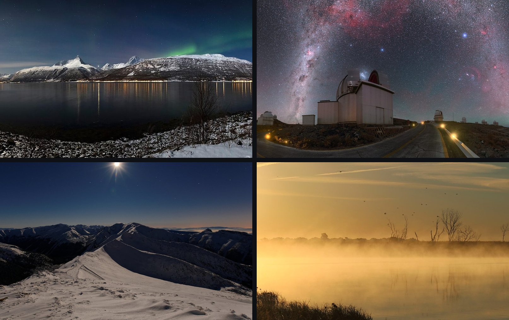

# dsh-image-skin

**Give your DeepSeek Harness web UI a look of its own.** Upload your own images, GIFs or videos
and paint them onto the big regions of the interface, stick draggable stickers on the sidebar and
composer, and dial in how much the panels let through. Everything stays on your machine.

中文说明见下方 [中文](#中文说明) · 作者 [Hwayn](https://github.com/Hwayn-pixel)



*The wallpapers above are public-domain / CC images (see [Credits](#credits--图片致谢)) — pick a few
you love and the UI becomes yours.*

## Why this one

There are several plugins in this space, and most of them do the same thing: take one picture and
generate a colour palette from it. This one takes the opposite approach — **you place artwork
exactly where you want it**, and it does a few things the others do not:

- **Per-region artwork** — window backdrop, center column, sidebar, welcome/empty state, right
  panel, composer area. Each region gets its own image, its own fit mode, its own on/off switch.
  *(one picture → palette; that is not what this is)*
- **Motion** — a looping `mp4`/`webm` video as the window backdrop, GIFs anywhere, and a playback
  rate slider that applies to every video the plugin renders.
- **Light and dark, configured separately** — two independent sets of artwork, so the theme flip
  swaps wallpaper too. A shared image acts as the fallback for whichever mode has no override.
- **Stickers** — two free-floating images anchored to the sidebar and the composer; drag to move,
  drag the corner to scale; positions persist.
- **Panel translucency** — one slider makes DSH's own surfaces see-through so the wallpaper shows;
  the wallpaper itself is deliberately *not* dimmed by it.
- **Accent & AI ornament** — the plugin can also paint the *skeleton* (buttons, inputs, dialogs,
  the rail behind them) with colours pulled from your wallpaper, so the interface stops looking
  grey. Level 0 does that locally, offline. Levels 1–4 ask a text-to-image model for a real
  ornamental frame — corner flourishes and a repeating edge, no text, no figures — which is then
  used as a border. Any OpenAI-compatible image API will do; the key stays on your machine.
- **Smooth, and it stays smooth** — the light/dark cross-fade animates only what a compositor can
  animate, and on a heavy DOM it stops touching text colour, which is what makes other
  implementations stutter on a long conversation.
- **Local-only, and reversible** — files live in `$DSH_HOME/image-skin/` and are served from your
  own machine. Disable the plugin and every style, sticker and video layer it added goes away.

## Install

DSH composes its web UI from a **profile**, and `dsh plugin` is a thin passthrough to pnpm inside
that profile.

```powershell
# 1. from npm
dsh plugin --profile web add dsh-image-skin

#    ...or from a local checkout
git clone https://github.com/Hwayn-pixel/dsh-image-skin.git
cd dsh-image-skin
npm install
npm run build
dsh plugin --profile web add -w .

# 2. restart the web host so the profile is recomposed
dsh --profile web --no-open

# 3. hard-refresh the browser (Ctrl+F5)
```

The bundled helper does steps 1–2 for you: `node scripts/install.mjs --profile web`
(add `--dry-run` to preview the commands it would run).

## Usage

**Settings → 图片皮肤 / Image skin.** One screen:

- **正在编辑 / Editing** — a segmented control for 浅色模式 / 深色模式, i.e. *which set of images you
  are editing*. Flipping it also flips the live theme, so you configure what you see.
- **界面区域 / Regions** and **角标贴图 / Stickers** — one card per area: thumbnail, name, where
  its artwork comes from (`浅色专用` / `两模式共用` / `未设置`), and its controls.
- **全局效果 / Global** — panel opacity, video playback rate, and the accent level (0 = local
  palette only, 1–4 = AI-generated ornament strength).
- **存储 / Storage** — `清理未使用图片` collects stored files no area references any more.

| Control | Meaning |
|---|---|
| Upload | image, GIF, `mp4` / `webm` (≤ 24 MB) |
| Shared image | one image used by both modes unless a mode overrides it |
| 启用 | per-area on/off |
| 填充 | `cover` / `contain` / `tile` (regions only) |
| 编辑位置 | stickers only — drag to move, corner handle to scale |
| 面板不透明度 | one slider for all DSH surfaces |

## Compatibility

Developed and tested against `@deepseek-ai/dsh@0.1.5-rc.1`.

DSH is a Cordis-based app: this plugin is one row in the web profile, contributing a settings
namespace (host) and a `settings.section` page (browser). Region hosts are located through
**CSS-module class-name suffixes** (`_centerCol`, `_sidebarCol`, `_hero`, `_pane`,
`_composerSeat`, …) rather than hashed prefixes, but they are still DSH internals: a release that
renames them can break region targeting. Panel translucency overrides the documented theme tokens
(`--dsw-alias-bg-base`, `--dsw-alias-bg-layer-1/2`, `--dsw-alias-bg-overlay`,
`--dsw-specific-sidebar-fill`, `--dsw-specific-app-shell`) and nothing else.

## Development

```powershell
npm install
npm run build       # src/index.ts -> lib/index.js (ESM host half)
                    # src/client/index.ts -> lib/client.js (browser half, ModuleLoader format)
npm run watch       # rebuild on change
npm run typecheck   # tsc --noEmit
npm test            # offline host-half suite (68 assertions, no DSH process, no network)
npm run demo:provider   # fake image API on 127.0.0.1:8899 — exercise the AI ornament flow with no key
```

`lib/` is committed on purpose — DSH loads the built halves — and `prepublishOnly` rebuilds it so a
published artifact can never drift from `src/`.

### Trying the AI ornament without a key

`tools/demo-provider.mjs` is a dependency-free stand-in for a text-to-image service: it answers
`POST /v1/images/generations` with an ornament drawn locally from the colours in the prompt, so the
whole chain (prompt → generate → wall → apply) can be tested offline.

```powershell
npm run demo:provider          # http://127.0.0.1:8899/v1
```

Then 设置 → 图片皮肤 → AI 纹样 → 服务商 `自定义（OpenAI 兼容）`, Base URL `http://127.0.0.1:8899/v1`,
模型 ID `demo`, Key 任意, and press 生成装饰. The same route is covered headlessly: the offline
suite drives `/providers`, `/prompt` and `/gen` with a scripted `fetch`, including the failure
branches (bad provider, missing key, non-JSON reply, 401, unreachable host).

## Extending

1. add an id to `IMAGE_AREAS` in `src/index.ts` — the settings schema is generated from it;
2. add the same id and a label to `AREAS` in `src/client/index.ts`;
3. add a `REGION_SELECTORS` entry, and clean it up in `disposeSkinDom()` if it adds DOM.

## Credits / 图片致谢

The gallery images are not part of the plugin; they are licensed wallpapers used to illustrate it.

| File | Author | License |
|---|---|---|
| `01-aurora-lyngen.jpg` — *Aurora borealis above Storfjorden and the Lyngen Alps in moonlight* | Ximonic | CC BY-SA 3.0 |
| `02-milkyway-la-silla.jpg` — *Milky Way Arching Over La Silla* | P. Horálek / ESO | CC BY 4.0 |
| `03-winter-night-moon.jpg` — *Winter night in mountains with moon* | Maciej Kraus | CC BY 2.0 |
| `04-misty-lake-sunrise.jpg` — *Misty Morning Sunrise, Lake Andes NWR* | USFWS | Public domain |

All four were retrieved from Wikimedia Commons and resized; only the resized copies live in this
repository.

## Authors / 作者

- **Hwayn**（幻弈）— *author* / 作者：设计、实现与主要代码。
- **Yucheng Xiao**（肖宇成）— *contributor* / 协作者：方向、需求、测试，以及让这个项目得以公开。

## License

MIT — see [LICENSE](LICENSE).

---

## 中文说明

**给你的 DeepSeek Harness 网页界面换上一副自己的样子。** 上传你自己的图片、GIF 或视频，铺到界面的
几个大区域上；往侧栏和输入框贴能拖动、能缩放的角标；再调调面板透不透。图片全部只存本机。

上面那四张壁纸是公有领域 / CC 授权的图（见 [图片致谢](#credits--图片致谢)）——挑几张你喜欢的，界面就成你的了。

### 为什么用这个

这个领域里已有几个插件，大多做的是同一件事：拿一张图，自动生成一套配色。这个插件的思路相反——**你把画面
放到你想要的位置**，而且多做了几件别家没做的：

- **按区域换图**：窗口背景 / 中栏 / 侧边栏 / 欢迎页 / 右栏 / 输入区，每个区域各自的图、各自的填充方式、
  各自的开关。（"一张图→配色"不是它。）
- **动态**：窗口背景支持循环 `mp4` / `webm` 视频，各处都能放 GIF，还有一个播放速率滑块统一控制。
- **浅色深色分开配**：两套独立的图，切主题时连壁纸一起换；没单独配的模式会自动回退到"共用图"。
- **角标**：侧栏和输入框上各贴一个，拖动移动、拖角缩放，位置会记住。
- **面板不透明度**：一个滑块让 DSH 自己的面板变半透明、透出壁纸；**壁纸本身不会被调暗**。
- **装饰纹样（Accent）**：除了壁纸，插件还能给界面的“骨架”（按钮、输入框、弹窗、它们背后的轨）染上从壁纸里
  取出来的颜色，不让界面一直发灰。**档位 0** 是本机取色、不联网；**档位 1–4** 交给生图模型画一张真正的
  装饰边框（角花 + 连续边饰，只要花纹、不要文字和人），再当作边框用。**任何 OpenAI 兼容的生图接口**都能接，
  Key 只存本机。
- **顺滑，而且是持续的顺滑**：明暗交叉淡化只动合成器能动的属性；元素多的时候它干脆不碰文字颜色——这正是
  别家实现会在长对话里卡顿的原因。
- **只存本机、可一键还原**：文件落在 `$DSH_HOME/image-skin/`，由本机自己提供；禁用插件后它加过的样式、
  贴图、视频层全部撤掉。

### 安装

```powershell
dsh plugin --profile web add dsh-image-skin
# 然后重启 DSH，浏览器 Ctrl+F5
```
本地开发用 `dsh plugin --profile web add -w .`；也可以直接跑 `node scripts/install.mjs --profile web`。

### 用法

**设置 → 图片皮肤**，一屏搞定：

- **正在编辑**：浅色 / 深色分段控件，选的是"你正在配哪一套图"；切换时会同时把界面主题切过去，边配边看。
- **界面区域** / **角标贴图**：每个区域一张卡片——缩略图、名称、图的来源（浅色专用 / 两模式共用 / 未设置）和操作。
- **全局效果**：面板不透明度、视频播放速率、装饰纹样档位（0 = 本机取色，1–4 = AI 生成强度）。
- **存储**：「清理未使用图片」会回收不再被任何区域引用的文件。

### 结构

| 文件 | 作用 |
|------|------|
| `src/index.ts` | Host 半：注册 `ui-image-skin` 设置命名空间 + 图片上传/存储/回收/服务路由 `/dsh-image-skin/*` |
| `src/client/index.ts` | 浏览器半：绑定设置、把图片贴到对应区域、注册设置二级菜单 |
| `cordis.patch.yml` | bundle patch：把插件注册进 web profile |
| `build.mjs` | 把 TS 编译成 `lib/index.js` + `lib/client.js` |
| `test/host.test.mjs` | 宿主半离线测试（路由 / 上传上限 / GC / 路径穿越 / AI 纹样全分支） |
| `tools/demo-provider.mjs` | 本机假生图服务（`npm run demo:provider`），无 key 也能跑通“生成→图墙→应用” |

**扩展新区域**：`src/index.ts` 的 `IMAGE_AREAS` 加一个 id（schema 自动生成字段）→
`src/client/index.ts` 的 `AREAS` 加同 id + 标签 → 加 `REGION_SELECTORS` 并在 `disposeSkinDom()` 里清理。
其余（设置菜单、上传路由、存储、回收）自动生效。

### 许可

MIT — 见 [LICENSE](LICENSE)。
