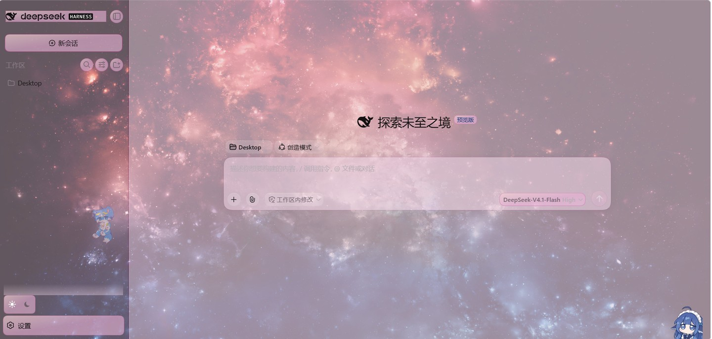
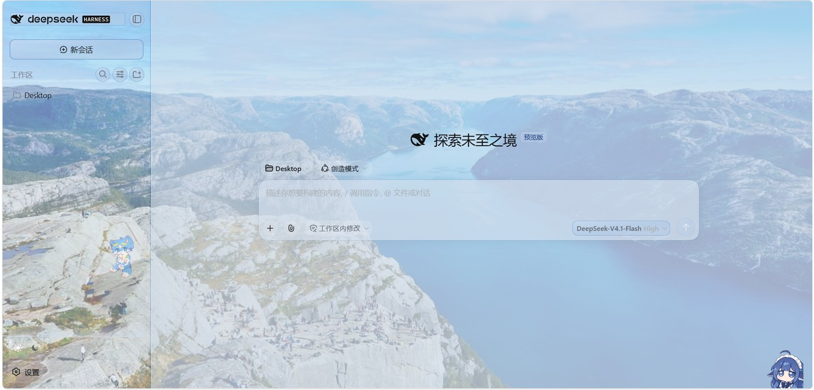
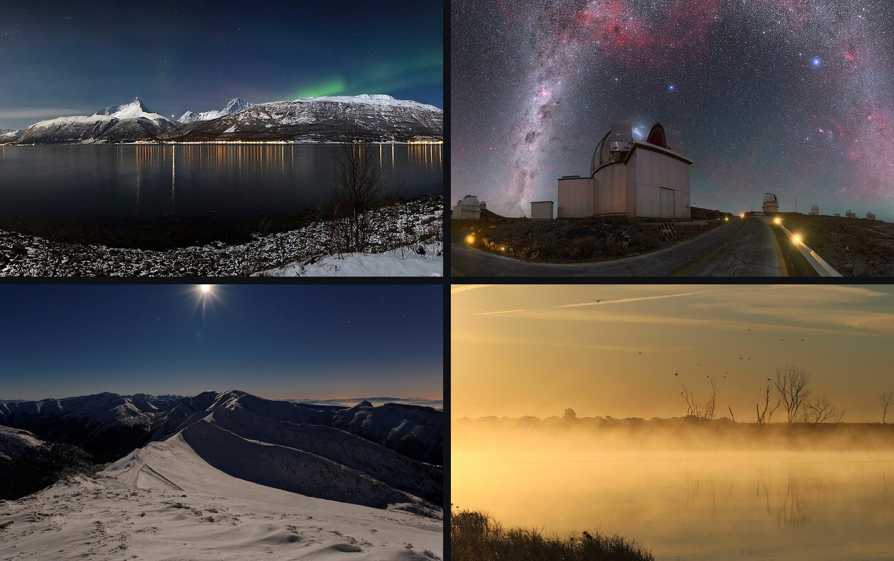

# dsh-image-skin

> ⚠️ **桌面版（Electron 应用）必读。** **≤ 0.4.1** 的版本声明了客户端服务 `settingsScope`，而 DSH **0.2 把它去掉了**。
> DSH 0.2 把"永远不激活的客户端条目"当成**致命错误**，于是桌面版会直接拒绝启动：
> `web boot: 1 entry did not activate — dsh-image-skin: pending (waiting for service: settingsScope)`。
> **0.4.2 及以后没有问题。** 如果你的安装器总是给你 0.4.1，就**点名要版本**——指定具体版本可以绕过年龄策略：
> ```
> dsh plugin --profile web add dsh-image-skin@0.4.7     # 或在 profile 里：pnpm add dsh-image-skin@0.4.7
> ```
> 不带版本的 `... add dsh-image-skin` 是**范围**解析，而 pnpm 的 `minimumReleaseAge` 只会自动挑"发布时间够久（约 6 小时）"的版本——
> 所以它可能静默给你一个旧版，或者在你要求的新版本太新时直接报
> `The latest release of dsh-image-skin is "0.4.3"`。
> （应用自己的 **「禁用第三方插件…」** 按钮也能先把你救进去。）

### 给你的 DSH 网页界面，换上一副**属于你自己**的样子。

[](https://www.npmjs.com/package/dsh-image-skin)
[](LICENSE)
[](https://github.com/Hwayn-pixel/dsh-image-skin/actions/workflows/test.yml)

上传你自己的**图片、GIF 和循环视频**，铺到 DeepSeek Harness 网页界面的几个大区域上；往侧栏和输入框贴**能拖能缩的角标**；用**从壁纸里取来的颜色**给整个界面上色；再调调面板透不透。
**不用账号、不用上传、不走云端——所有东西都只存在你本机。**

English → **[README.md](README.md)**



*插件的**实际效果**——壁纸铺在磨砂面板后面，界面的颜色从这张图里取。你看到的一切都在本机：图、配色、角标。*

---

## 一句话亮点

| | |
|---|---|
| 🖼️ **按区域换图** | 窗口背景 / 中栏 / 侧边栏 / 欢迎页 / 右栏 / 输入区——每个区域各自的图、各自的填充方式、各自的开关。 |
| 🎬 **会动** | 窗口背景能放循环 `mp4` / `webm`，哪里都能放 GIF；一个滑块统一调播放速率。 |
| 🌗 **浅色深色分开配** | 两套独立的图，切主题时连壁纸一起换；没单独配的那边自动回退到"共用图"。 |
| 🧸 **角标** | 侧栏和输入框上各贴一个，拖动移动、拖角缩放，位置会记住。 |
| 🫧 **面板半透明** | 一个滑块让 DSH 自己的面板透出壁纸——而**壁纸本身不会被调暗**。 |
| 🎨 **颜色取自你的画面** | 界面不再发灰：按钮、输入框、弹窗、还有它们背后的轨，都用壁纸里采样出来的**一个色相**来染（视频也会真采一帧），每个色阶都过了对比度校验。 |
| ✨ **可选的 AI 装饰框** | 另有一个开关，让生图模型画一张真正的装饰边框当面板框用——任何 OpenAI 兼容接口都行，Key 只存本机。 |
| 🪶 **顺滑，而且一直顺滑** | 元素再多、对话再长也不卡：交叉淡化只动合成器能动的属性，树一重就干脆不碰文字颜色。 |
| 🔒 **只存本机，一键还原** | 文件落在 `$DSH_HOME/image-skin/`；禁用插件，它加过的样式、贴图、视频层全部撤掉。 |

## 为什么用这个

这个领域里已有几个插件，大多做的是同一件事：拿一张图，自动生成一套配色。这个插件的思路相反——**你把画面放到你想放的位置**——而且多做了几件别家没做的：

- **给的是"画面"，不只是"配色"。** 窗口背景、侧栏图、能拖的角标，在这里都是一等公民。（"一张图自动配一套色"**不是**它。）
- **整套路数只从一个色相长出来。** 采样到的几种颜色收敛成一个色相，每个角色（描边 / 墨色 / 面色）从它派生、逐个校验对比度——所以是**协调**，不是打架。**档位滑块只决定颜色染多深**（淡 / 标准 / 浓 / 呼吸），**不决定画什么**。
- **为长期使用而做。** 别家实现在长对话里会卡；这个只动合成器友好的属性，树重的时候不再去碰文字颜色。
- **天生的"可还原"。** 关掉它，什么都不留。



*同一套界面，换一张壁纸——面板、描边、墨色全部重新从新图里派生。*

## 安装

DSH 从 **profile** 组装它的网页界面，`dsh plugin` 是对 profile 内 pnpm 的一层薄封装。

```powershell
# 1. 从 npm 装
dsh plugin --profile web add dsh-image-skin

#    或从本地仓库装
git clone https://github.com/Hwayn-pixel/dsh-image-skin.git
cd dsh-image-skin
npm install
npm run build
dsh plugin --profile web add -w .

# 2. 重启网页宿主，让 profile 重新组装
dsh --profile web --no-open

# 3. 浏览器硬刷新（Ctrl+F5）
```

仓库自带的小工具能替你跑完第 1–2 步：`node scripts/install.mjs --profile web`
（加 `--dry-run` 可以只预览它要执行的命令）。

## 用法

**设置 → 图片皮肤**，分两级：

*一级——选工作台。*「贴图」管图片，「AI 纹样」管装饰。**窗口没有图就进不了 AI 纹样**（装饰要从那张图里取色）；第一次进去会先弹一页「用之前先看这五条」的提示（说清什么离开本机、什么要花钱、什么留在本地）——下面有「不再显示」。

*贴图 / Images* 页：

- **正在编辑**：浅色 / 深色分段控件，选的是"你正在配哪一套图"；切换时会同时把界面主题切过去，**边配边看**。
- **界面区域** / **角标贴图**：每个区域一张卡片——缩略图、名称、图的来源（`浅色专用` / `两模式共用` / `未设置`）和操作。
- **全局效果**：面板不透明度、视频播放速率。
- **存储**：「清理未使用图片」会回收不再被任何区域引用的文件。

*AI 纹样 / AI ornament* 页：颜色深浅档位（0 = 只描一圈细线 … 4 = 最浓）+ 三条配色路线（整屏染色 / 只染三处 / 双声部）+ 取色与材质的读数 + 生图工作台（服务商 / Key / 张数 / 尺寸 / 风格 / 提示词预览 / 结果图墙）。

| 控件 | 含义 |
|---|---|
| 上传 | 图片、GIF、`mp4` / `webm`（≤ 24 MB） |
| 共用图 | 两个模式都用它，除非某模式单独覆盖 |
| 启用 | 按区域的开关 |
| 填充 | `cover` / `contain` / `tile`（仅区域） |
| 编辑位置 | 仅角标——拖动移动、拖角缩放 |
| 面板不透明度 | 一个滑块管所有 DSH 面板 |

## 兼容性

开发与测试环境：`@deepseek-ai/dsh@0.1.5-rc.1`。

DSH 是基于 Cordis 的应用：这个插件是 web profile 里的一行，贡献一个设置命名空间（宿主）和一个 `settings.section` 页面（浏览器）。区域宿主是靠 **CSS-module 类名后缀**（`_centerCol`、`_sidebarCol`、`_hero`、`_pane`、`_composerSeat` …）定位的——不是哈希前缀，但这些终究是 DSH 的内部实现：某天改了类名，区域定位就可能失效。面板半透明只覆盖文档里给出的主题 token（`--dsw-alias-bg-base`、`--dsw-alias-bg-layer-1/2`、`--dsw-alias-bg-overlay`、`--dsw-specific-sidebar-fill`、`--dsw-specific-app-shell`），别的一律不碰。

## 开发

```powershell
npm install
npm run build       # src/index.ts -> lib/index.js（宿主半，ESM）
                    # src/client/index.ts -> lib/client.js（浏览器半，ModuleLoader 格式）
npm run watch       # 改动即重建
npm run typecheck   # tsc --noEmit
npm test            # 宿主半离线测试（68 条断言，不启 DSH、不联网）
npm run demo:provider   # 本机假生图服务（127.0.0.1:8899）——无 key 也能跑通 AI 纹样全流程
```

`lib/` 是**故意提交进仓库**的（DSH 直接加载编译产物），`prepublishOnly` 会重建它——保证发布出去的东西永远和 `src/` 一致。

### 不想花 key，先试 AI 纹样

`tools/demo-provider.mjs` 是个零依赖的生图服务替身：它对 `POST /v1/images/generations` 的回复，是用提示词里的颜色**在本地画**出来的一张装饰边框。所以"提示词 → 生成 → 图墙 → 应用"整条链，断网也能验证。

```powershell
npm run demo:provider          # http://127.0.0.1:8899/v1
```

然后 设置 → 图片皮肤 → AI 纹样 → 服务商选 `自定义（OpenAI 兼容）`，Base URL 填 `http://127.0.0.1:8899/v1`，模型 ID `demo`，Key 随便，按「生成装饰」。同一条路线在离线测试里也全跑过：`/providers`、`/prompt`、`/gen` 都用脚本化 `fetch` 驱动，连失败分支（服务商写错、缺 key、返回非 JSON、401、连不上）都覆盖了。

## 扩展新区域

1. 在 `src/index.ts` 的 `IMAGE_AREAS` 加一个 id——设置 schema 会自动生成对应字段；
2. 在 `src/client/index.ts` 的 `AREAS` 加同 id + 标签；
3. 加一条 `REGION_SELECTORS`，如果它会往 DOM 里加东西，就在 `disposeSkinDom()` 里清理。

其余（设置菜单、上传路由、存储、回收）自动生效。

## 关于维护 🐢

这是个**学生做的业余项目**——我在上课和作业的缝隙里写它，所以回复和修复可能**慢**，请多担待。

不过话说回来：**issue、想法、PR 都非常欢迎**，每一条我都会看。
如果你喜欢这个插件，一个 ⭐ 就是很大的鼓励——它告诉我这东西值得我一直回来做下去。

## 图片致谢

图库里的图不属于插件本体，只是文档里用来举例的、有授权的壁纸。



| 文件 | 作者 | 许可 |
|---|---|---|
| `01-aurora-lyngen.jpg` — *林根阿尔卑斯山上的极光* | Ximonic | CC BY-SA 3.0 |
| `02-milkyway-la-silla.jpg` — *拉西拉天文台上空的银河* | P. Horálek / ESO | CC BY 4.0 |
| `03-winter-night-moon.jpg` — *山中的冬夜与月* | Maciej Kraus | CC BY 2.0 |
| `04-misty-lake-sunrise.jpg` — *安第斯湖畔的晨雾日出* | USFWS | 公有领域 |

四张都取自 Wikimedia Commons 并做过缩放；仓库里只保留缩放后的版本。

## 作者

- **Hwayn**（幻弈）— 作者：设计、实现与主要代码。
- **Yucheng Xiao**（肖宇成）— 协作者：方向、需求、测试，以及让这个项目得以公开。

## 许可

MIT — 见 [LICENSE](LICENSE)。
